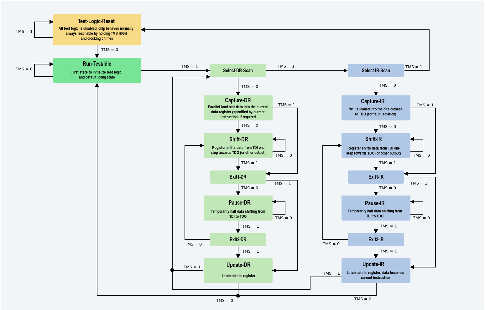

# Project

## What is a FPGA ?

Field Programable Gate Array, re-programable using hardware description languages (Verilog or VHDL). Not build for specific design task vs ASIC. It can be used to implement any thing 

## What is JTAG

Join Test Action Group

4 ports:

- TDI: Input  
- TDO: For the output  
- TMS: Control what to do with the input  define the mode
- TCK: Synchronize clocks

All those are the Test Access Ports (TAP). Interact with new registers: mainly Register Boundary scan. A shift registers place between the logic Core and the i/os, to read pins' states, inject test patterns, control pins individually. 
3 Modes : Capture Mode (BSR reads state of all pins and store it), Shift Mode (This allows an external tester to update the state of all pins or read back captured values),Update Mode (apply shifted values to the actual pins)  

Jtag cells : place between core and I/Os, can be in **"functional"** thus not blocking anything or in **"test"** actually controlling I/Os (outputs and inputs)

JTAG can be used to verify the conexion is actually the one implemented in the chip, by forcing some input on a pin and verify no unexpected output on other pins. One example of the tool is XJTAG that automatised those tests. **Validate the fabrication of the chip**, whikle avoiding difficult test methods that access directly the hardware (like osciloscop, or logic analyser).  

Jtag can also be used to developp tests:  
BSDL file (Boundary scan description language), describe boundaries scans capabilities (BSR details - pin name and type, boundaries scan cell positions in the shift register, default value and behavior during test mode -, Device info, Jtag instruction set).  
If a component does not support JTAG but is connected to a JTAG-compatible device, you may still be able to test or control it indirectly using JTAG boundary scan. Use the JTAG components it is connected to.  

JTAG used to program FPGA after being mounted on an integrated circuit. Allows in-circuit programming (whitout having to remove the device). Program other components like flash memory via interconnection with JTAG Components.

Benefits of JTAG : Program on mounted FPGAs better in production line, and able to uptdate the firmware, software or data stored on components in the systems, even if the board is already assemble. Great for bug fixes or updates post manifacture.  

Technical aspects : 

- TCK : Synchronize clocks
- TMS : (Test Mode Select) Determine next state on rising edge  
- TDI : (Test Data in) Data shifted in memory or device logic at rising edge of TCK when in the correct state. (Output from our perspective)
- TDO : (Test Data Out) Data shifted out on rising edge of TCK (From our persepective input)
- Optional TRST : Reset TAP controller state machine

Registers : One instruction register and two or more data registers 

- **Instruction Register** : Contains the instruction used by TAP to know what to do with the received signals

- **Data Registers**:  

  - **BSR** : register used to move data in and out the pins
  - **BYPASS** : this is a single-bit register that passes information from TDI to TDO. It allows other devices in a circuit to be tested with minimal overhead.  
  - **IDCODES** : this register contains the ID code and revision number for the device. This information allows the device to be linked to its Boundary Scan Description Language (BSDL) file. The file contains details of the Boundary Scan configuration for the device.

  

Instructions :  

- **BYPASS**: No interaction with the Device, it TDO is directly connected to TDI
- **EXTEST**: he device's boundary scan cells are used to drive output values onto the device’s I/O pins (outputs) and read values from those pins (inputs). This makes it possible to check the electrical functionality of the device's pins as part of a test process
- **SAMPLE**: Retreive the values of the pin during normal execution of device
- **RELOAD**: Puts value in the Device pins

## First Link

[First video Link](https://hackaday.com/2024/12/29/38c3-xobs-on-hardware-debuggers/)

8 Necessary requirements :

- Memory :
  - **Peak**
  - **Poke**
- Register :
  - **Read**
  - **Write**
- Control :
  - **Halt**
  - **Step**
  - **Reset**
  - **Break**

  IN JTAG Can't read without writting and inversely 

    

Conclusion Implements debugger for RISC-V architecture.

## Second Link  

[Second Link](https://github.com/tomverbeure/ecp5_jtag)

Lattice ECP5 is a familly of FPGA. 
**Primitives** are links betweeen user logic and JTAG pins. Like an API for communication with the core logic via JATG pins.  
THey are cells that controls the value of the JTAG pins. Between the TAP and the core logic.  
Different Primitives for different architecture of FPGA.  

**This is a Project that is an exameple of how to use JTAGG**

## Link 3

[link 3](https://www.youtube.com/watch?v=txf7GpPq0jo)

how to use openOCD and Latice Propel sdk  
OpenOCD open on chip debugger, tool to debug a software project on a device.  
How to use OpenOCD in propel builder software.  

## Link 4

[Link 4](https://github.com/stnolting/neorv32/discussions/28)

Implementation of the debugging hardware parts for a custom RISK-V Processor. With many detail on how it was implemented (DTM, DM) how to provide an JTAG interface for OpenOCD to communicate with  

## Link 5

[link 5](https://github.com/openrisc/tutorials/blob/master/docs/Debugging.md)  

How to debug a openRISC using openOCD and also provide [an example of the low level that provides JTAG interface to communicate with openOCD](https://github.com/olofk/adv_debug_sys)
Basic notions on how to use openOCD and GDB

Jtag quick explanation 
[link 5.1](https://youtu.be/-3zWnIupqYM?si=eNtUCQI9tW-r3SYy)

## Link 5.5

[Link 5.5](https://www.fpga4fun.com/JTAG2.html)

Great description of how JTAG is supposed to work :

- The finite state machine
- What is TMS
- TDI and TDO
- Shift-DR state
- Shift-IR state

## Link 6

[Link 6](https://www.embecosm.com/appnotes/ean7/html/ch04s03s01.html)

How Jtag is used by OpenRISC 1000 especially for instructions **CHAIN_SELECT** and **DEBUG**, with the different debug chain to read/write different memory places :

- RISC_DEBUG access Special Purpose Registers
- TRACE_TEST 
- REGISTER: Access CPU's control registers 
- WISHBONE: Acess Memory via fishbone

## Link 7 

[link 7](https://github.com/openrisc/openOCD/blob/master/doc/manual/primer/jtag.txt)

Explain waht is JTAG and does it works, with a concrete example of how to use it in a system with multiple wired devices.  
Not very clear how does the FSM works and what are the different Registers. 

## Link 8 

This link was not working 

## Link 9 

[Link 9](https://www.allaboutcircuits.com/technical-articles/jtag-test-access-port-tap-state-machine/)
JTAG FSM + example of interface

## Questions  

1. What do you expect from me now that a have some understanding of the field ?
2. I remembered you talking about three "milestones" in this project waht are they again ?
3. What is the debugger for ? Which FPGA type (ECP5 like on the link you provided) ? is the FPGA running something specific like a risk-V processor that we want to debug or is just the FPGA not regarding what it is running (What is the user logic)?
4. What the debugger should be able to do by the end of the project ?
5. For this project do i need to have access to a the real FPGA for testing my implementation for example ?
6. why having a video about using openOCD in propel if you said i should be quartus ?
7. What is already implemented what should i strat with, where can i find thiose resssources?
8. OpenOCD was very  present in the documentation you gave me, in wich way is it related to the project?
9. What are the next steps : If I have ideas try to figure out the next steps if not what are nexts steps you think i should do?
