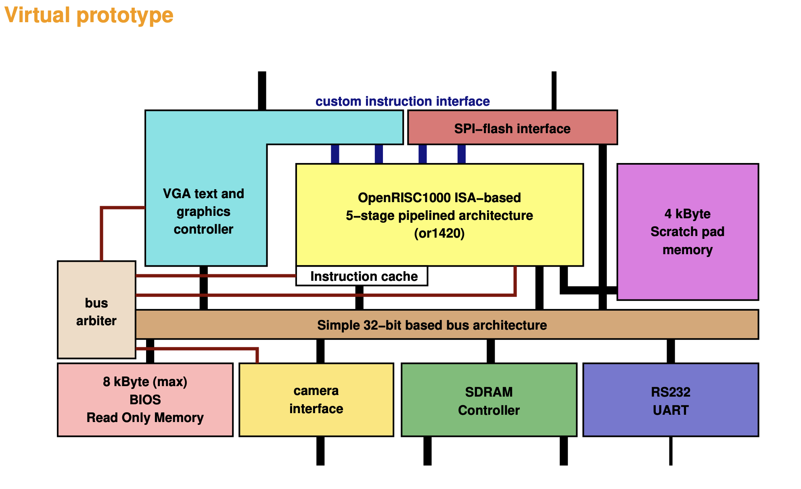

# Week 2

## Instalation of software

### OSS CAD Suite

A collection of open-source tools for hardware design (HDL) and FPGA development.  


### Toolchain 

asked to change the default terminal to bash but i kept using zsh.  
The build is not working : 

```shell
make[2]: *** No rule to make target `../libcpp/libcpp.a', needed by `cc1-checksum.cc'.  Stop.
make[1]: *** [install-gcc] Error 2
make: *** [install] Error 2
```

A cross-compiler allows you to compile code on one system (like your PC) and run it on a different architecture (like OpenRISC). Compile code for openRISC.  

### Coolterm

An RS232 communication program is used to send and receive serial data through an RS232 interface.

| Tool                  | Purpose                                         |
|-----------------------|-------------------------------------------------|
| VS Code               | Writing and editing C/C++ code                  |
| OpenRISC GCC Toolchain| Compiling the code for OpenRISC (or1k-elf-gcc)  |
| convert_or32          | Converting compiled binaries for execution      |
| CoolTerm/Cutecom      | Sending programs over RS232 to the Gecko5Education board |
| OSS CAD Suite         | Debugging and simulating OpenRISC programs      |

## Getting informations from courses 

### Virtual Prototype

What is a Virtual Prototype (VP) is a system that emulates the complete system on a functional level. Thus describe the architecture the FPGA will run.  

- our VP is cycle true  (accurate on every cycle clock)
- Written in Verilog
- Running on the GECKO5Education
- Completly observable
- based on a openRISC micro controler
- BFH developed version for industry projects

It is a micro COntroller architecture  

  

### First exercise session 

Work around with tools

## Current architecture 

Gecko5Education uses the JATGG primitive

[Explanation of JTAG](https://interrupt.memfault.com/blog/diving-into-jtag-part1)


## What I have done

Install all the softwares describe in the course

Get through the Virtual Prototype. Try to understand what to do with the JTAG

From what I understand our FPFGA has a JTAGG interface :  


And should create the IP core that links this interface to real instrcutions to be able to write to the SRAM but also to allow debugging using openocd  
From our last discussion i also understood that we have a JTAG chain with two free spaces one for writting into the SRAM and the other to allow debugging  
Thus the IP core has two roles :

1. Expose an interface to read and write to/from the SRAM
2. Expose an interface to give a sufficient set of instructions to oepnOCD so that we can debug  

I'm not sure about that but from what i understood the IP core take the JTAG inputs and transform it into internal signal to allow multiple instruction to execute  

1. Install neccessary tools from the embeded course page 
2. Search on web to clarify the steps of the project to build a timeline 
   1. The course material and concrete implemetentation of the virtual VP (no sign of JTAG)
   2. About JTAGG (Almost find nothing)
   3. About JATG ip core don't really understood 
   4. About how debugging was implemented in other type of processor (RISC-V using a DTM to receive JTAG inputs and convert them to command for the DM that then sends the request to the cores/memories)
3. Stuck on understanding what are the concrete steps and how to link all the things i read from internet  

Last week you asked me to prepare a timeline for this project, I had the big steps in my mind from the previous meeting. But i was defiicult for me to assign a time for each of those big steps and finds the intermeditae steps. 
So i tried to search on internet for missing informations but i could not find something satisfying. I think for now i do not have the knowledge to make this timeline with all the steps. So what i would apriciate is that we take those big steps and we clarify them together with all the necessary steps to implemetent them.

### Part 1 implementing the IP core 

From what i understood the IP core is :

- an hardware module that converts the instructions received by the strandart JTAG interface into concrete execution of those into the openRisc
- For example if it receives an instruction to read the PC register from JATG interface to concrete signal to the cpu to receives this value
- In this understaniding i lost all the princple of JTAG implemented in each components to control input and output of the component all of this working in chain -> confuse
- For me it is located between the standart JTAG interface and other components but how do they communicate ? Using the common bus or linked to other component using JTAG tdi, tdo, tms ... building a chain 
- In the second case i saw nothing implemented on the Virtual Prototype to enable JATG at each components so do i have to also implement the JTAG interface for each component for being able to use JTAG? (if yes is it sufficient to build it for memory and CPU)
- You said we have 2 empty slots in the JTAG chain how are they related to the JTAG IP core ?
- Also how can i build the ip core at first and then implement all the other things like is it not fully related to what i want it to be used for ?

### Part 2 Writting in the SRAM the program

- Same question about the JTAG chain 
- Bridge the IP core and the SRAM 
- If i understood well the idea is to have a faster way to put the program into the SRAM than using UART, do this via JTAG,
- then implement a software that load a program given as input in the SRAM via JTAG automatically. Could this be done via openOCD for example

### Part 3 Implement bridge with openOCD

- Ideally once I have the IP core created the idea wuold be to simply linked it with the openOCD
- I have to make sure that the IP core is providing all the necessary commands to make openOCD works 
- Then link it to gdb so that we can use gdb on the program running in our environment
- How can i phisically connect the board JTAG interface to my PC (do i need a JATG adapter)

### Part 4 JTAGG

- on the config file of the VP i read about a JTAGG interface i don't really understand what it is 
- From what I understood it only have two instrucions ER1 and ER2 that can be user defined how do I deal with that to link it with openOCD

Time on the project

### Timeline draft

1. Implement the IP core
2. SRAM component in the JTAG chain
   1. concrete component
   2. software to write the program in the SRAM for all the platform
3. OpenOCD component in the JTAG chain
   1. concrete OpenOCD component
   2. Be able to run OpenOCD on the board
   3. Initialization script to use OpenOCD with the implemented configuration
   4. Link GDB

### Weekly Timeline

| Week          | Dates                  | Tasks                                      | What needs to be done                       |
|---------------|------------------------|--------------------------------------------|--------------------------------------------|
| Week 3        | 18th Mar - 24th Mar    | Implement the IP core                      |                                            |
| Week 4        | 25th Mar - 31st Mar    | Implement the IP core                      |                                            |
| Week 5        | 1st Apr - 7th Apr      | Implement the IP core                      |                                            |
| Week 6        | 8th Apr - 14th Apr     | Implement the IP core                      |                                            |
| Week 7        | 15th Apr - 21st Apr    | Implement the SRAM component in the JTAG chain |                                            |
| Week 8        | 22nd Apr - 28th Apr    | Implement the SRAM component in the JTAG chain | Software to write in the SRAM              |
| Week 9        | 29th Apr - 5th May     | Implement the SRAM component in the JTAG chain |                                            |
| Week 10       | 6th May - 12th May     | Implement the Debugger component in the JTAG chain |                                            |
| Week 11       | 13th May - 19th May    | Implement the Debugger component in the JTAG chain |                                            |
| Week 12       | 20th May - 26th May    | Implement the Debugger component in the JTAG chain |                                            |
| Week 13       | 27th May - 28th May    | Finalize and review                        |                                            |

### Questions :

1. We going through the VP probably after compiling it i found a JTAGG interface ? I do not clearly understand what it is ? 
   1. Where is the IP core located and what is it supposed to do ? (It should provide the necessary to link the JTAG of the FPGA and the Debugger, can be used to write program in the SRAM faster than using DRAM)
   2. Is it between the JTAGG interface and the actual JTAG of the FPGA ? 
   3. Where can i found all the documentation for the specification of the VP/the FPGA we are using?
   4. Where can i get inforamtions about the JTAG chain used like the size of their registers, the components there. (look the BDSL file of the chip)
   5. Am I suppose to communicate through this interface ? I read that it supports two instrcutions ER1 and ER2 that can be user defined how does this complete the set of thing openOCD couls ask for ?
   6. In JATG we have a core for each component of the chain with a FSM, data registers and instruction register but where does the JTAGG interface lies ?
   7. you said last time there is two empty slots in th JTAG one for writting into the DRAM and one for the link with the debugger ? What does these two components actually do like to write something in the SRAM we just have to use JTAG to input the program we want to write to the SRAM by changing it's input ??
2. The first step wuould be to create the IP core to unable us to use JTAG bu i have issue doing that since i dont really get the JTAG architecure in our case. from what I understood using 4 pins you can communicate trhough the whole chain and get instructions execute for each individual components then why not just using this 4 pins ? Why creating a IP core?

