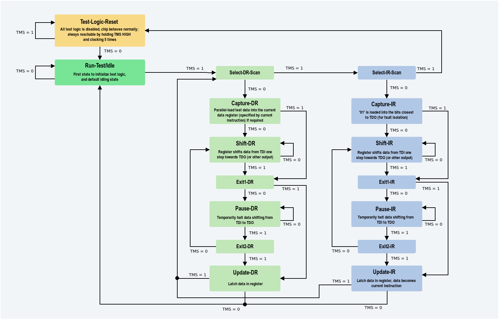
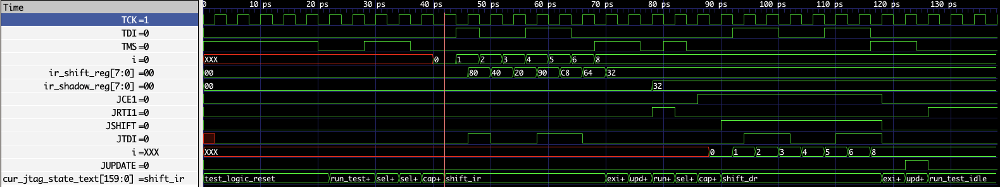

# Week 3 : Understand the JTAGG interface perfectly

## JTAGG interface

  

### Inputs

1. **JTDO1**: If ER1 instruction is shifted into the JTAG instruction register, TDO output will come from JTDO1.
2. **JTDO2**: If ER2 instruction is shifted into the JTAG instruction register, TDO output will come from JTDO2.
3. **TCK\***: Clock used to clock the registers and the TAP controler, *connected to the actual JATG pins*
4. **TMS\***: Control states machine witching for TAP controler, *connected to the actual JATG pins*
5. **TDI\***: Test Data input, *connected to the actual JATG pins*

### Outputs

1. **TDO\***: Test Data Output, *connected to the actual JATG pins*
2. **JTCK**: Signal comming from TCK and going to the FPGA logic (the internal clock)
3. **JTDI**: Comming from the TDI and connected to the FPGA logic
4. **JRTI1**: If ER1 instruction is shifted into the JTAG instruction register, JRTI1 will go high when TAP controller is in Run-Test/Idle state.
5. **JRTI2**: If ER2 instruction is shifted into the JTAG instruction register, JRTI2 will go high when TAP controller is in Run-Test/Idle state.
6. **JSHIFT**: Goes high when the TAP controler is in the state SHIFT-DR
7. **JUPDATE**: Goes high when the TAP controler is in the state UPDATE-DR
8. **JRSNT**: *(Active low)* goes low when in the state TEST-LOGIC-RESET
9. **JCE1**:  If ER1 instruction is shifted into the JTAG instruction register, JCE1 will go high when TAP controller is in Capture-DR or Shift-DR states.
10. **JCE2**:  If ER2 instruction is shifted into the JTAG instruction register, JCE2 will go high when TAP controller is in Capture-DR or Shift-DR states.

### Concrete Logic behind Outputs :

1. TDO is **z** if not in a shift state, else **ir_shadow_reg\[0\]** if in shift_ir, else JTDOx if in shift_dr state with x corresponding to the instruction in the ir_shadow_reg
2. JTCK = TCK
3. JTDI = TDI on posedge of TCK
4. JRTI1 = run_test_idle && (ir_shadow_reg == 8'h32)
5. JRTI2 = run_test_idle && (ir_shadow_reg == 8'h38)
6. JSHIFT = shift_dr  && (ir_shadow_reg == 8'h32 || ir_shadow_reg == 8'h38)
7. JUPDATE = update_dr  && (ir_shadow_reg == 8'h32 || ir_shadow_reg == 8'h38)
8. JRSNT = !test_logic_reset
9. JCE1 = (capture_dr || shift_dr) && (ir_shadow_reg == 8'h32)
10. JCE2 = (capture_dr || shift_dr) && (ir_shadow_reg == 8'h38)

### TAP controller

The logic controler of this interface is the standart JTAG TAP :  

#### JTAG TAP State Machine

##### General States

- **Test-Logic-Reset**: Resets all test logic, making the chip behave normally. Always reachable by holding TMS HIGH and clocking five times.
- **Run-Test/Idle**: Default state for initializing test logic; used when no scanning is happening.

##### Data Register (DR) Path

- **Select-DR-Scan**: Entry point for DR operations.
- **Capture-DR**: Loads test data into the currently selected data register.
- **Shift-DR**: Moves data serially from TDI to TDO one step per clock cycle.
- **Exit1-DR**: Temporary exit before either pausing or updating DR.
- **Pause-DR**: Temporarily stops shifting without losing data.
- **Exit2-DR**: Option to return to shifting or proceed to updating DR.
- **Update-DR**: Latches shifted data into the register.

##### Instruction Register (IR) Path

- **Select-IR-Scan**: Entry point for IR operations.
- **Capture-IR**: Loads predefined bits ("01") for fault isolation.
- **Shift-IR**: Moves instruction data serially from TDI to TDO one step per clock cycle.
- **Exit1-IR**: Temporary exit before either pausing or updating IR.
- **Pause-IR**: Temporarily stops shifting without losing data.
- **Exit2-IR**: Option to return to shifting or proceed to updating IR.
- **Update-IR**: Latches shifted instruction into the register, making it the active instruction.

#### Inputs/Outputs

**Inputs**: 

- **TCK**
- **TMS** : Controls the transitions
- **TDI** : Not used

**Outputs**:

- **Test_logic_reset**: True when in the Test_logic_reset state
- **Run_Test_idle**: True when in the Run_test_idle state
- **Capture_dr**: ""
- **Shift_dr**: ""
- **Update_dr**: ""
- **Capture_ir**: ""
- **Shift_ir**: ""
- **Update_ir**: ""

Concrete Example of how it's working : [TAP example1](https://interrupt.memfault.com/blog/diving-into-jtag-part1) [TAP example 2](https://github.com/openrisc/openOCD/blob/master/doc/manual/primer/jtag.txt)

### How does it works ?

The JTAGG interface supports two instructions :

1. **ER1**: 0x32 (0b110010)
2. **ER2**: 0x38 (0b111000)

Depending on the instruction choosed one of the two chain of the IP core is used

### Example of usage

The idea will be to send "01100110" to the first instruction chain **h32**

1. First we need to store the **h32** in the instrucion register to select the first chain
    1. Set TMS to 1 for at least 5 clock cycles to return in the Test_Logic_Reset from anywhere in the FSM
    2. Set TMS to 0 1 1 to reach the Select-IR-Scan state and select the Instruction path (Test_logic_reset -> Run-Test/Idle -> Select-DR-SCAN -> Select-IR-Scan)
    3. Set TMS to 0 to reach the Capture_IR state, here the instruction register is shifted in the the shift instruction register (since we reset earlier it is zeroes)
    4. Shift **h32** in the shift register
       - Set TMS 0 0 0 0 0 0 0 0 to enter Shift_IR state and shift the TDI value in the 8 bits of the shift register
       - Set TDI 0 0 1 1 0 0 1 0 to put **h32** in the shift register
    5. Update the IR register with the value in the shift instruction register by setting TMS to 1 1 and reaching Update_IR state
    6. Now the **h32** instruction is loaded into the instruction register
2. Now we need to send "0110011" to the first instruction chain
    1. Set TMS to 1 to move from the Update_IR state to the Select-DR-SCAN and to select the data path
    2. Set TMS to 0 to move to the Capture_DR state (Here no register just activate outputs signal: JCE1)
    3. Send "01100110" to the chain
       - Set TMS to 0 0 0 0 0 0 0 to enter and stay in shift_dr state, here the chain *knows* because JCE1, and JSHISHT are set high
       - Set TDI to 0 1 1 0 0 1 1 to send the value to the chain since JTDI is connected directly to TDI
    4. set TMS to 1 1 to stop shifting and reaching Udate-DR (JUPDATE set high)
    5. set TMS to 0 to return to the state where the process runs normally

Above we have a writting example, a example from reading is trivial since we just have to listen to the **TDO** pin that is link to the JTDO of a specific instrcuction depending on which instruction is loaded

### Questions

1. How can I find all pins of the board so that I can connect them to my designs
2. Can you show me a demonstration of how to put a circuit on the board
3. How can i debug the JTAGG interface if i don't have access to the source code ? using leds for the signals?