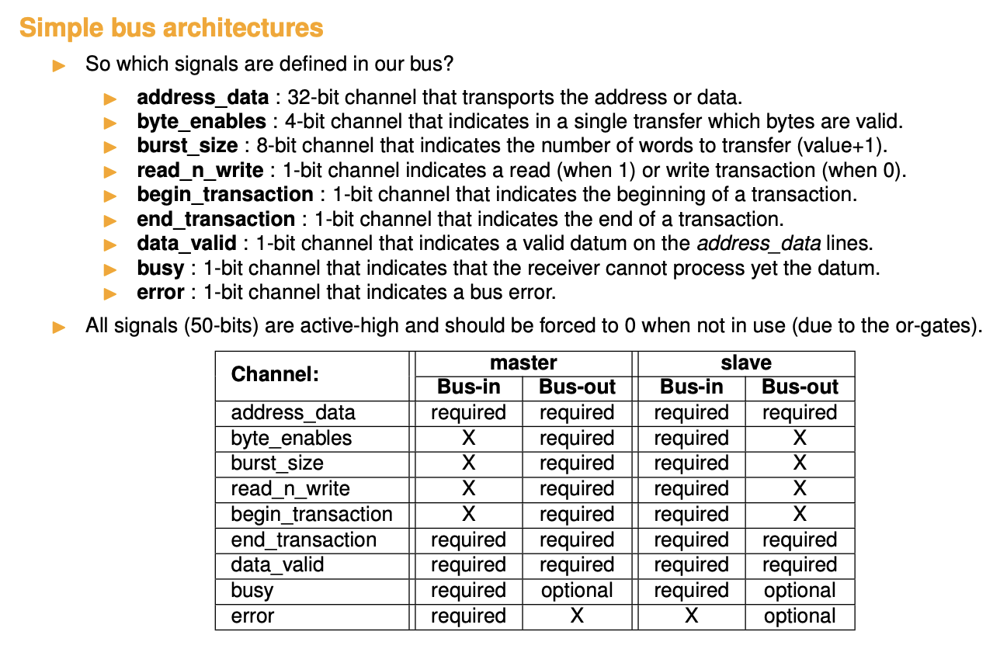

# Week 6

## Objectives

1. Light up the other leds of the column
2. Create a program that will make all the process easier
3. Check on other architecture if it works
4. Start understanding the RAM

## Light up the other leds

The first thing I have done this week was to be able to light up the other leds, before only the first 3 leds could be lighted up.  
To be able to choose the colors of the 10 leds in a column I augmented the size of the registers in the chain1 to 30 bits (3 RGB bits per leds). Hence 
we now have to shift 30 bits using the JTDI. The format of the data sent also changed :  

- data[9:0]: the **red** bits of all the leds
- data[9:0]: the **green** bits of all the leds
- data[9:0]: the **blue**  bits of all the leds

All the signals are active low thus 0 lights up the led, 1 shut it off. For an example let's try to light up one led out of two to cyan:

1. For a single led in CYAN is red=1, blue=0, green=0 thus **\[0,0,1\]** (remember active low)
2. For a completely shut off a led : red=1, blue=1, green=1 thus **\[0,0,1\]**
3. The red part of the data shift will be: **\[1,1,1,1,1,1,1,1,1,1\]**
4. The green part of the data shift will be: **\[0,1,0,1,0,1,0,1,0,1\]** 
5. The blue part of the data shift will be: **\[0,1,0,1,0,1,0,1,0,1\]** 
6. Hence sending this data: {red, green, blue} = **\[1,1,1,1,1,1,1,1,1,1,0,1,0,1,0,1,0,1,0,1,0,1,0,1,0,1,0,1,0,1\]** will light up cyan one light out of two

## Create a program

The second step here was to create a simple program that will make the communication more intuitive without having to use directly low level openOCD commands 
such as ```irscan``` and ```drscan```. The program connect lunch the openOCD server using the config file, and connects to it. This program offers an interactive interface 
where we can use few commands: 

1. led \<number/all\> \<color\>: lights up the light located at number (or all of them) with the selected color. The color available are :
   1. red, r
   2. blue, b
   3. green, g
   4. yellow, y
   5. cyan, c
   6. magenta, m
   7. black, k
   8. white, w
2. column \<number\>: set the column number
3. help: display the help message
4. exit: exit the program  


## Testing on other mchines :

### Windows 

1. Install wsl and attach the board to it using the tuto on the moodle page
2. Stay here for the moment 


### Linux

I don't have access to a physical linux machines and trying on different vm i encounters issues to : maps the USB to the vm and accessing the oss-cad-suite  
The easiest way to test it would be to use a physical linux machine


## Understanding the SRAM I need to communicate to 

### What is a should i be writting to

**The goal would be to use the JTAG interface to read and write in this SRAM?**

Synchronous Dynamic random Access Memory : DRAM that is connected to the clock of the processor. Allows faster it to be faster and 
more efficient than a non synchronized one. It is a volatile memeory thus when shutting down the board the data is not remain  

The actual sdram component looks like this :  

```verilog
module sdramController #( parameter [31:0] baseAddress = 32'h00000000,
                          parameter        systemClockInHz = 40000000 ) // supports up to 100MHz
                       ( input wire         clock,
                                            clockX2,
                                            reset,
                         input wire [5:0]   memoryDistanceIn,
                         output wire        sdramInitBusy,
                         input wire [1:0]   sdramDelay,
                         
                         // here the bus interface is defined
                         input wire         beginTransactionIn,
                                            endTransactionIn,
                                            readNotWriteIn,
                                            dataValidIn,
                                            busErrorIn,
                                            busyIn,
                         input wire [31:0]  addressDataIn,
                         input wire [3:0]   byteEnablesIn,
                         input wire [7:0]   burstSizeIn,
                         output wire        endTransactionOut,
                                            dataValidOut,
                                            busyOut,
                         output reg         busErrorOut,
                         output wire [31:0] addressDataOut,
                         
                         // here the off-chip signals are defined
                         output wire        sdramClk,
                         output wire        sdramCke,
                                            sdramCsN,
                                            sdramRasN,
                                            sdramCasN,
                                            sdramWeN,
                         output wire [1:0]  sdramDqmN,
                                            sdramBa,
                         output wire [12:0] sdramAddr,
                         inout wire [15:0]  sdramData);
```

We can clearly see that it is connected to the bus architecture of the openRISC. But also has some signals to off-chip signals 

### The bus architecture 

The idea is to exchange the data from one part to the other one. (Transport information)

1. Memory access
2. Type of access
3. The data
4. Some handshake


In our system we have a shared bus: it uses transactions and allow some **burst**
We have master devices and Slave devices  
Masters initiate the transaction : (I guess the IP core will be a master device, and the sdram controller will be the salve)

All device has two ports : a bus-in where the signal enters and a bus-out where the signals goes out. Unidirectionnal communication.

All the bus-out are OR together that forms the in-port. **Put all zeroes when not communicating**  

Be very carefull about the cycles or otherwise every can become shit  



- **byte_enable**: how many 32 bits words do i want to transfer
- **read_n_write**: From a master point of view : do i want to read or wirte to a slave 
- **Data valid**: is the data valid ?
- **Busy**: Slave indicating that it is busy and the data is comming to fast
- **Error**: If the address is not mapped

**The address will always be a byte address (8bits)**

SDRAM will always but the busy bit because : 

1. The initialisation
2. The SDRAM is 16bit addressable but we are reading 32bits on the bus


## My ideas 

How do I give the address, the size, the data to the instruction chain ?

- Use a very specific order for example first 10 bits are the size, the next 32 is the address, the rest is the data
- Since i only have a single input : The tdi => I think it's the only option
- Since I have two chains one could be the writting the other could be the readin
- I need a big shift register that's is used to buffer the data before sending it

## Goal for next week 

- Think about all details needed for communicating wiht the SDRAM
- Think about how to do it
- Start working on a new version of the IP core that write in the memory

## Question

1. What are the off-chip signals of the sdram ? Are they usefull for my project
2. What is this file ? udev file for linux systems (place in /etc/udev/rules.d) what does it do 
3. The presentation will be next week : what could be a title for this project since it has multiples parts?
4. From what i unserstood our bus architecture is a simple one (the first in the course) right ?
5. Where can i find the inforamtion about the SDRAM (like the size the adress)
6. What is the request signal used by the master to initiate transaction? I did'nt see it in the signals.
7. What is the Byte_enable signal?
8. How do concretely add my master to the bus architecture
9. Can you quickly explain me the pw3 and can it be usefull in my case ? 
10. where can i find the address of the different slaves ?
11. You talked about DMA in your course I just wanted to make sure that i do not need it right ? (beacause it is used to transfert chunk of data btw different slaves).