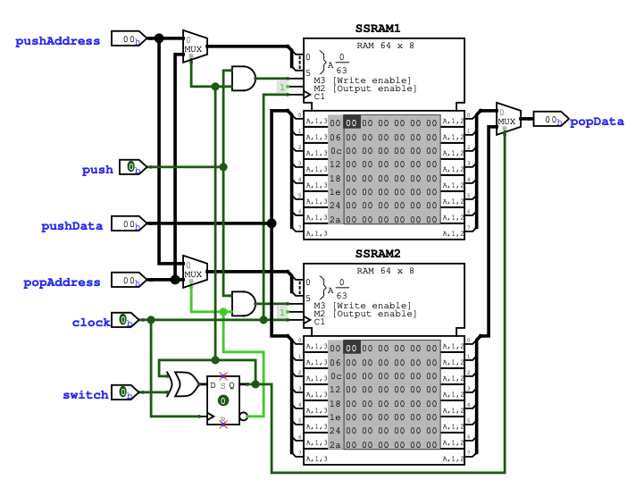
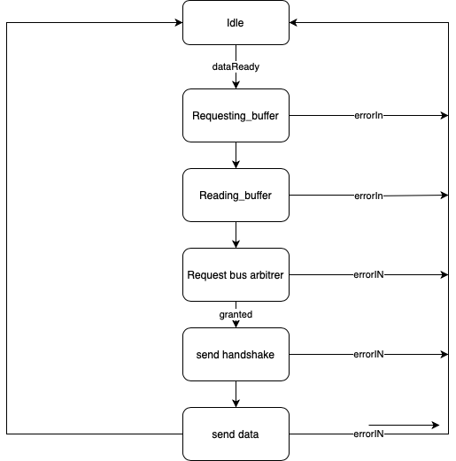
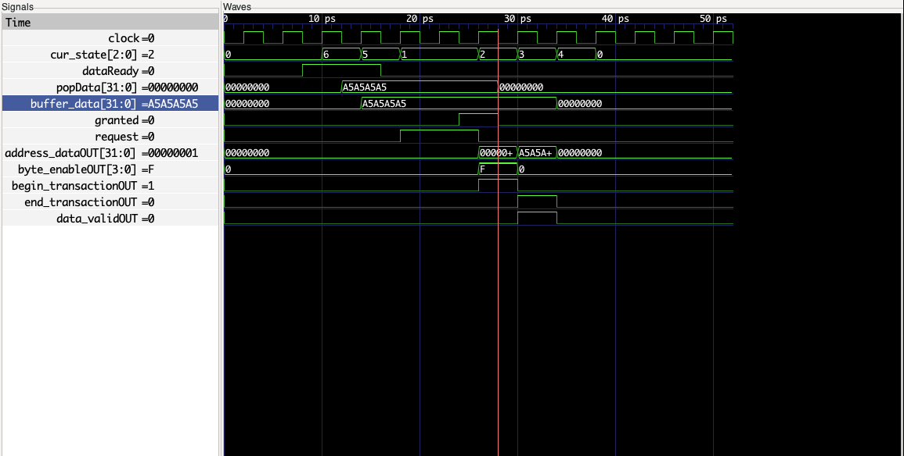
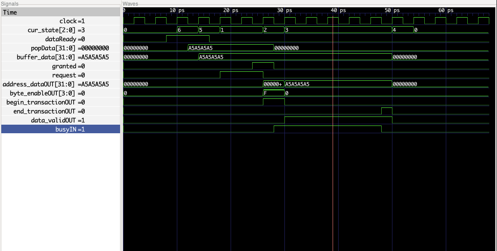
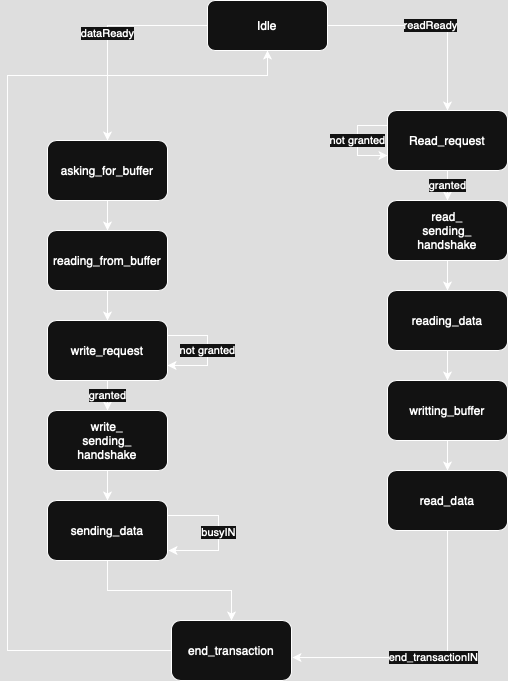
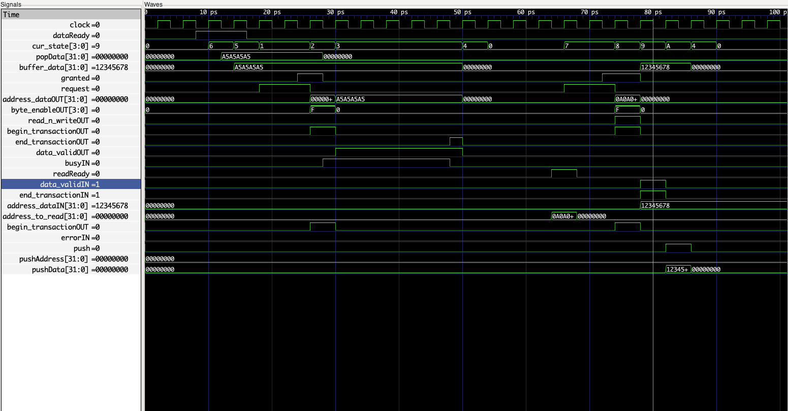

# Week 7

## Answer to last time questions :


1. What are the off-chip signals of the sdram ? Are they usefull for my project
    They are not usefull for this project i can just leave them as it
2. What is this file ? udev file for linux systems (place in /etc/udev/rules.d) what does it do 
    This file allows the linux users to access the FPGA it gives the user permissions to communicate with the board
3. The presentation will be next week : what could be a title for this project since it has multiples parts?
    Title : JTAG support for the GECKO5Education Board
4. From what i unserstood our bus architecture is a simple one (the first in the course) right ?
    Yes it is the share bus architecture that is used 
5. Where can i find the inforamtion about the SDRAM (like the size the adress)
    Address is 0x000000
6. What is the request signal used by the master to initiate transaction? I did'nt see it in the signals.
    The signal request is a signal used by master to ask the permission to use the bus to the arbitrer once it is accpeted the master can begin the transaction
7. What is the Byte_enable signal?
    Explain on the picture : but the idea is to say which part of the 32 bits will be used by the salve 
8. How do concretely add my master to the bus architecture
    The arbitrer has some free space for new master
9. Can you quickly explain me the pw3 and can it be usefull in my case ? 
    It is actually the same thing as me just communicating to a GPIO rather than the RAM but the idea is the same maybe checkout what is asked
10. where can i find the address of the different slaves ?
    ???
11. You talked about DMA in your course I just wanted to make sure that i do not need it right ? (beacause it is used to transfert chunk of data btw different slaves).
    Yes it is usefull : to empty out the pingpong buffer that we will be using 

## Objectives of this week

1. Continue working on the usage in other machines
2. Start reflecting on how to modify the ipcore for reafding and writting in the memory (FSM, Instruction)
3. Prepare the presentation for the tenth

## Instruction

We need to choose what the instructions will look like so that we can use the JTAG interface to communicate to the other commponent of the bus  

Ideally we want those instructions :

1. Write Data 0b01
2. Read Data 0b10
3. Get Status 0b00

Thus we should allocate 2 bits at the of the instruction to select the one we want.  
We would also would like to be able to communicate with any of the commponent of the bus so maybe add a 32 bit address to tell where we want to write/read. (Maybe 30 bits are enough since it is byte addressable)
(Should we also add the byte enable bits to write a single byte, a short (2 bytes), or an int (4bytes))  
And Finally we should add the data we want to use so we can allocate 32 bits of the instruction carrying the data. 

thus the instruction would look something like this :

| (32 bits) data | (4 bits)  byteEnable | (32 bits) address | (2 bits) instruction |  

But for a simple implementation we will try to make the IP core read/write a single 32 bits word at the start of the RAM (0x0000), thus this instrctution will do the job:

| (32 bits) data | (2 bits) instruction |

## The design used

The design we want will look something like this :  
  

The idea is the following:  

The IPcore will get the data from the JTAG interface and then will fill a pingpong buffer of 2x1Kbyte. Then there is a DMA on the other side of the buffer that will send the data in batches.  
All this will be monitor by a FSM and the user will be kept in touch with the progress using the status return at each instruction.  

### The IPcore

As explained above the IP core will run a FSM commanded by the instructions received on the TDI and shifted in a instructionn register. 

### The PingPong buffer 

  

The Idea of this buffer is that the producer write in one memory while the consumer reads in the other memory and once both of them are done we switch buffers.  
This will allows the Ip core to write in a buffer while the DMA will send the data already filled by the Ipcore before. And inversly when we want to write something.
The Size of this pingpong buffer is 2KB because the memory of the FPGA or the board are ones with those size.  

### The DMA

The DMA is in charge of the transaction over the bus. It will initiate all the reads and write request from the IPCore. Important : should use burst to gain some clock cycles rather than writting the data word by word. But to not occupy the 
Whole bus it shouldn't use the max burst size.  


## Tryin windows again

1. make wsl working with the usb from the moodle page
2. Install the oss-cad-suite and add it to the path
3. Put the file on moodle at this place ```/etc/udev/rules.d/```
4. run this command to update the permissions ```sudo udevadm control --reload```
5. clone the project to an accecible place in wsl (for me /home/titou)
6. verify ```sudo lsusb``` actualy show the board
7. install telnet ```sudo apt install telnet``` and pyhton3 if not already installed
8. run the script ```./synthetise.sh``` in the scripts directory (Lights should light up)
9. Update the path in the config.cfg to map to the actual oss-ocd-suite dir
10. run the jtag_led.py python scripts 
11. enjoy

## Trying on Linux again

Not enough place on the virtual machine but pretty confident that it will work since i mad it work on windows

## Constructing a DMA

 the DMA should be able to read and write to any memory address on the bus and read or write the result on a buffer

### Writting part of the DMA 

This part is controlled by a DFA :  


Where when the data is ready in the buffer : 

1. The DMA asked the buffer for the data
2. The DMA reads the output
3. It asked the bus arbitrer for accessing the bus
4. When granted it starts the transaction
5. Then send the data until busy is not high
6. Closes the transaction


The idea here is that the DMA is able to write a single world from the pingpong buffer to a memory address (here simply 0x1).  

Here is the corresponding wave for a normal execution :  



Her is the corresponding wave for an excution with the slave being busy :  


### Reading part of the DMA 

Now that the writing DMA part is done we should also be a able to read a word at any address:  
To do that we update the DMA's FSM :  
  


The idea here is : 

1. When the readReady is rised : the DMA enters the part of the FSM where it will read at address ```address_to_read```
2. Then it asked for the to have access to the bus by requesting the bus architecture
3. Once the access is granted it initiate the transaction at the address above
4. Once the transaction is ended on the slave side it will write the result in the buffer 
5. Then free the buss access

Here is an execution of a read followed by a write :  


as we can see at the end the data read is pushed to the buffer.
In case of error the finite state machine goes in the idle mode and stop doing what it was doing

## Constructing the pingpong buffer

we have two possible solution to design this : 

1. Use a semidual ported ssram of 2kB
2. use two single ported ssrams of 1kB each

If we want to stay with the 2KB buffer and storing words in their entirity we need a buffer of $128*32$ bits dual port ssram

I'm a bit confused with the timing : 

## Objectives for the two following weeks 

1. Do the presentation
2. Make the smaller version work being able to read and write to the ram using JTAG
3. Update this smaller version to a bigger one with the ability to write any size of data

## Questions

1. For this design I'm using a single ssram of 2kB that is semi dual ported should i prefere the option wher i use two single ported ssram?
The idea would be to use a dual ported ssram and give a port to the ip core and to the DMA and the most significant bit just change depending on the switch reg
2. I choose to have 32 bits bandwidth to access a word per cycle and 64 entries to make it 2kB but it is not in the permissible SSRAM of the FPGA is it concerning?
wrong it is a byte is 8 bits not 4
3. Ask for the clock cycles
Here there is an issue : There should be a one clock cycle delay


