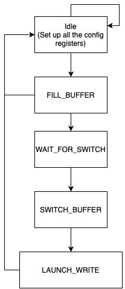
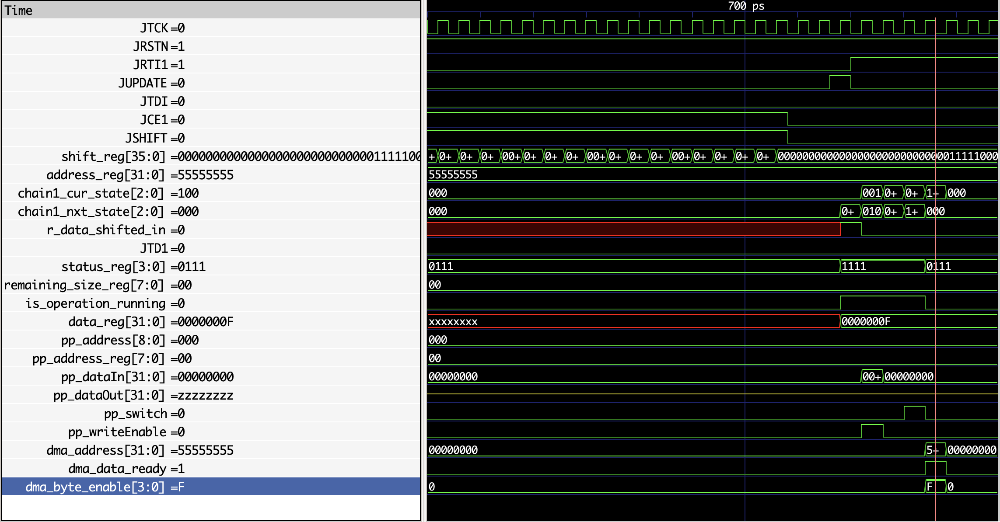
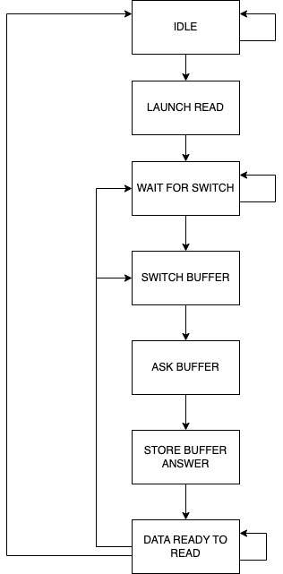
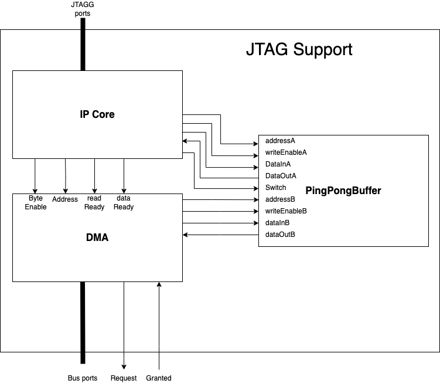
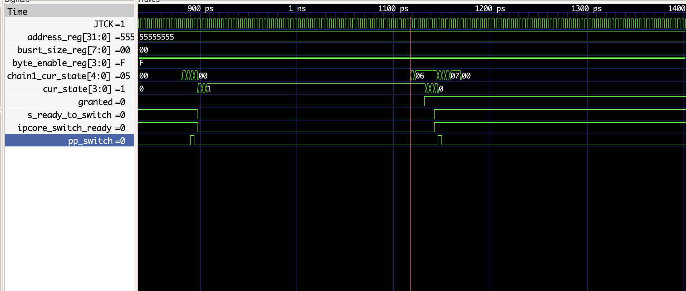

# Week 8 + holidays

## Objectives

Have a working version to read and write to the memory

## Changing the ping pong buffer

1. Change the size of the dual ported ssram 
2. Change from semi-dual to fully dual so that both DMA and IPCORE can read and write to the same buffer
3. Change the implementation of the pingpong buffer to handle this

Still an issue with the delay in the clock cycle in the SSRAM i don't have the good delay 

## Changing the DMA to use the new version of the pingpong buffer

Just change the communication interface with the pingpong buffer

## Changing the SSRAM 

The ssram does not produce any clock cycle delay when reading and i can't figure out why it happens. Still working on it for now i suppose it is working normally


## Modifying the Ip core 

What is needed to start reading and writting to a memory address in terms of user commands:

1. A command to set up the address
2. A command to Read the status of the whole system
3. A command to say the Byte enable
4. A command to send data
5. A command to start receiving
6. A command to receive data: need to write in order to read data 
7. Say how many bytes we want to receive or send 

Instruction size : 32 bits of data and few bits of command : for now 4 bits so 36 bits in total

The idea here will be to put everything in a single chain (arbitrarly 0x32) and communicate with it through multiple commands

Change the functionality of the chain1  to handle this : 
For the moment we don't care about the transaction size

### Instructions

| Data section (32 bits) | instruction code (4 bits) | Signification |
| ---------------------- | ------------------------- | ------------- |
| empty | 0000 | Read the status reg of the ipcore |
| address (32 bits) | 0001 | set the address reg to the value in the data section |
| byte_enable (4 bits) | 0010 | set the byte enable reg |
| Size (32 bits) | 0011 | set the size of the transaction in number of words |
| | 0100 ||
| | 0101 ||
| | 0110 ||
| | 0111 ||
| data to send | 1000 | write the data at the address loaded in the address reg |
| empty | 1001 | Start Read operation data | 
| empty | 1010 | write empty to empty out the data read |


### The status register

| Is data ready to read | Is reading going ? | Is sending running ? | is size loaded | is byte_enable loaded | is address loaded |

### Writing operation

The operation of writting is done in two phases:

1. Setting up the config registers
2. Actually send the data

The register that needs to be setted up :

- The address where we want to write
- The size of the data we want to write
- The byte enable register

They all can be set up using different instructions. 

Once the the send instruction is received the IPcore enter a fsm for the write :



- IDLE: Default state where the IPCORE wait for the next instruction
- FILL BUFFER: Add the data to the pingpong buffer (if the buffer is full the next state WAIT_FOR_SWITCH or the remaining data size reaches 0, else return to IDLE and wait other write instructions)
- WAIT_FOR_SWITCH: Wait for DMA signal that says that it is ready to switch the buffer
- SWITCH_BUFFER: switch the pinpong buffer
- LAUNCH_WRITE: Launch the transaction to the DMA and reset the operation running bit of the status reg if needed


A simulation of a write looks something like this :



### Reading operation

For the write operation we have two differents operations :

1. 1001 is used to launch the read operation (micro-architecturarly it ask the DMA to start the read)
2. 1010 is used to shifted out the data read and advance to the next one(If data is not ready the shifte register is shifted out 29 zeroes and the shift register, if it is ready 3 ones, the remaining size to read, and the data out)
3. When the data is ready to read the data shifted out is always the data read but using 2. make it advance to the next one

The read operation is a bit complexe since we have to wait for the DMA to execute part of the read operation to be able to actually read and also we need to write to actually get some data out 

When receive the operation to start the read operation (1001) the ipcore follow this FSM :



Where : 

- **IDLE** : The IP core is not doing anything except receiving instructions and update the config regs 
- **LAUNCH READ**: State entered after receiving the start reading operation (1001) in this state the IPCore send signals to the DMA to start the Reading from address in the reg file, enter the wait for switch after
- **WAIT FOR SWITCH**: In this stage the the IP core wait for the signal of the DMA saying that it is ready to switch and that there will be interesting data in the buffer once received move to next state
- **SWITCH BUFFER**: One clock cycle where the buffer is switched to be able to access the data read by the DMA
- **ASK BUFFER**: Instantiate the read operation in the buffer
- **STORE BUFFER ANSWER**: Store the result of the read and make the data ready to read for the user
- **DATA READY TO READ**: In this state the IP core the data shifted out will always be the data read but if the instruction 1010 is used then if it is the end of the transaction we move to the IDLE state and cleat any used reg if not we simply move to either SWITCH buffer if no valid data is in the buffer or Ask buffer in the other case.

## Try to connect everything together


Create a single component name JTAG_suport that encapsulate the ipcore, the pingpong buffer and the DMA. It is then connected to the JTAGG interface and the bus architecture as a master. 

Here is the design :



After many debugging it seems that i have a version of the JTAG support that can read and write at a memory address a single word (byte enable should also work)

Debug some issues :

- loop in the combinational logic transform them into registers
- loop in an ```always @(*)``` block

## Trying to see if the synthetized version can update the status reg

1. Synthetized the system 
2. Use IRscan to select the first chain
3. use drscan to set up the different config regs
4. Verify the output using the output of openOCD and the visual clues on the led array

It does actually and the ipcore is actually following the state it should follow but the DMA is not working on my sintethised design

For now the version is not working the DMA state is not changing in the syntethyzed version whereas in the simulation everything works greatly


## Things to do

1. Make the burst size actaully usefull
2. Make the is_ready_to switch not always to one (Solved set to one for only some states of the DMA)
3. Make the DMA and the IP core care about not writting the full buffer
4. Integrate them to the whole system
5. I supposed the DMA is always ready is it always the case ? (Not the case anymore)
6. Can't make transaction that needs more than a buffer for now
7. Handle errors
8. The launch state moves to idle even if dma has not finished
9. 