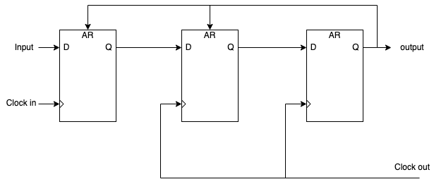

# Week 9

## Clock synchronizer 

Since the DMA should use the clock of the system and not the JTAG one we need to synchronize the signal from the IPcore to the DMA.

To do that we use this design :

Change the ping pong buffer to use a different clock for the DMA and the Ipcore

Chang the JTAG_support design to handle both clock speeds

## Integrate the design in the actual virtual prototype 

Create a new component that has the JTAGG component and the JTAG support component linked together

Connect this component to the rest of the design : 

1. Bus architecture:
    - address_dataOUT : s_jtagAddressData -> or with the other addressData signals
    - byte_enableOUT : s_jtagByteEnable -> or with the other byteEnable signals
    - burst_sizeOUT : s_jtagBurstSize -> or with the other burstSize signals
    - read_n_writeOUT : s_jtagReadNotWrite -> or with the other ReadNotWrite signals
    - begin_transactionOUT : s_jtagBeginTransaction -> or with the other BeginTransaction signals
    - end_transactionOUT : s_jtagEndTransaction -> or with the other EndTransaction signals
    - data_validOUT : s_jtagDataValid -> or with the other DataValid signals
    - busyOUT : s_jtagBusy -> or with the other Busy signals
    - address_dataIN : s_addressData -> bus signal for AddressData
    - end_transactionIN : s_endTransaction -> bus signal for endTransaction
    - data_validIN : s_dataValid -> bus signal for dataValid
    - busyIN : s_busy -> bus signal for busy
    - errorIN : s_busError -> bus signal for error
2. System:
    - system_clock : s_systemClock -> clock for the DMA
3. Bus arbitrer :
   - request : s_jtagRequestBus -> s_busRequests\[27\]
   - busGranted : s_jtagBusAck -> s_busGrants\[27\]

After adding the component we need to change the script to load all used verilog file and update the lpf to handle the led array

## Creating the ci for the DRAM : 

The way i implemented it is by simply linking all the signals of the DMA to interanl signal of the custum instructions
Verify in a testbench that everything is working correctly
But a compilation error in the tollchain used tried to fixe it but i didn't manage it

## Continue debugging on the board 

1. Solve a big issue with the reset signals that were not correctly mapped and caused an issue 
2. Still can't make it work on the board ...
3. Clock syncrhonizer issue that i don't know why : 
   1. Even when the signal is up the synchronized version is never up, My idea was that it was too fast to be noticeable but even the state of the DMA didn't not change 
   2. even when the signal is low the output signal still bounce from low to high
4. The DMA state does not update as expected
5. The IPcore is actually working on the board

## Issue:

1. The bus arbitrer is always busy so DMA can't access it 

## Questions :

1. Do you have any idea of when will be the final presentation ?
2. What about the report ?
3. Problem with the clock_synchronizer ?